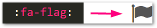

# Grav Markdown Font Awesome Plugin

The **Font Awesome plugin** for [Grav](http://github.com/getgrav/grav) allows you to use Font Awesome icons inline with markdown by wrapping the icon name in colons (Github/Slack "emoji style"):



# Prerequisites

The plugin works by looking for colon-wrapped icon names starting with the `:fa-` prefix and converting them to `<i>` tags.

This plugin doesn't contain the actual Font Awesome fonts, so make sure you are using a plugin or theme (such as Learn2 or Antimatter) that include the Font Awesome assets.

Also, Markdown Extra must be disabled.

# Manual installation

Download zip version of this repository, unzip to `/your/site/grav/user/plugins` and rename directory to `markdown-fontawesome`.

# Configuration

The markdown-fontawesome.yaml file contains only one configuration which turns the plugin on/off.

```
enabled: true
```

# Examples

```
Grab a cup of :fa-coffee: and write some :fa-code:
```

Will produce the following HTML:

```
Grab a cup of <i class="fa fa-coffee"></i> and write some <i class="fa fa-code"></i>
```

# Known limitations

- Does not work with Markdown Extra enabled (conflicts with definition lists which start with a colon)
- Icon names are not validated, so html tags are created even for non-existent icons like `:fa-not-a-real-icon:``
- Additional fa classes such as `fa-spin` and `fa-2x` not yet supported.

# Alternatives

If you prefer shortcode syntax `[fa=cog /]`, consider using the [Grav Shortcode Plugin](https://github.com/getgrav/grav-plugin-shortcode-core#fontawesome) which also supports Font Awesome.

# License

MIT license. See [LICENSE](LICENSE.txt)

# Cred

This plugin was inspired by the python markdown extension [fontawesome-markdown](https://github.com/bmcorser/fontawesome-markdown) and the first version was based on code from the [Grav Markdown Color Plugin](https://github.com/getgrav/grav-plugin-markdown-color).
