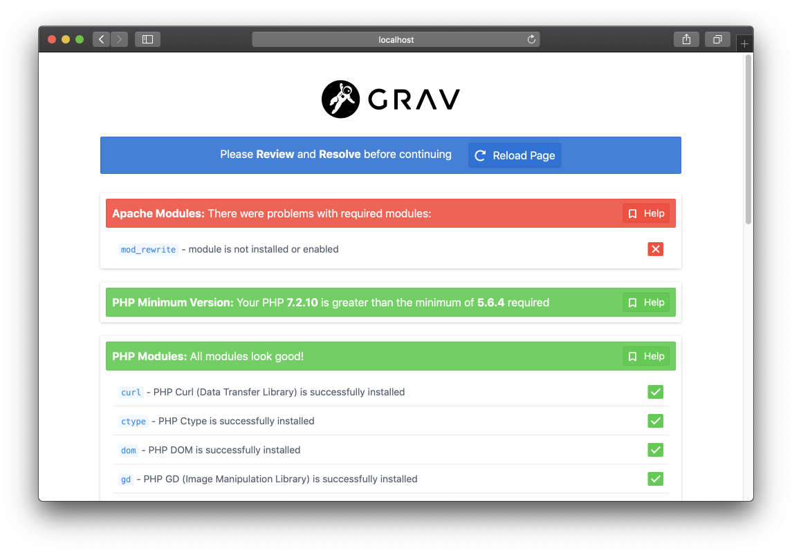
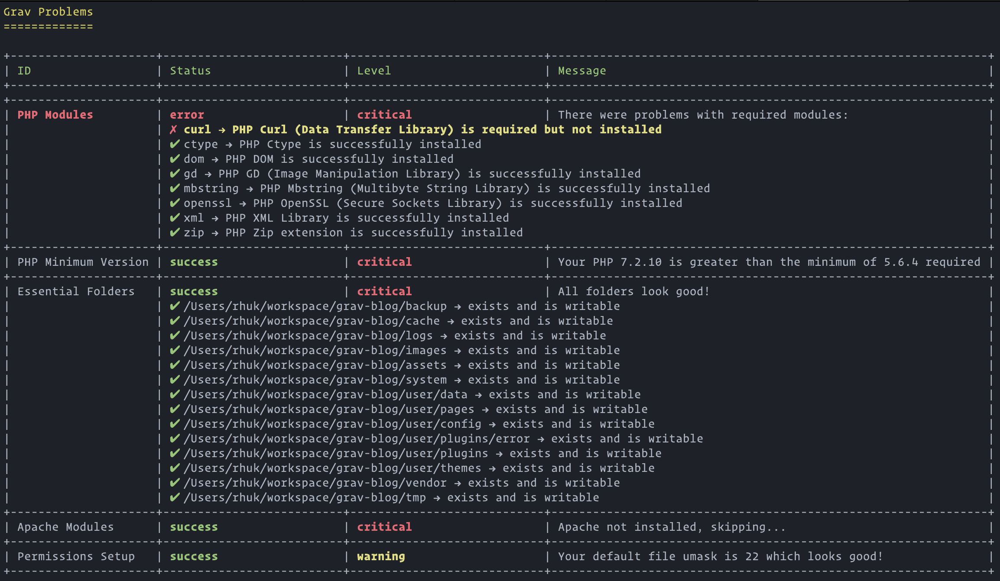

# Grav Problems Plugin



`Problems` is a [Grav](http://github.com/getgrav/grav) Plugin and allows to detect issues.

This plugin is included in any package distributed that contains Grav. If you decide to clone Grav from GitHub, you will most likely want to install this.

# Installation

Installing the Problems plugin can be done in one of two ways. Our GPM (Grav Package Manager) installation method enables you to quickly and easily install the plugin with a simple terminal command, while the manual method enables you to do so via a zip file.

## GPM Installation (Preferred)

The simplest way to install this plugin is via the [Grav Package Manager (GPM)](http://learn.getgrav.org/advanced/grav-gpm) through your system's Terminal (also called the command line).  From the root of your Grav install type:

    bin/gpm install problems

This will install the Problems plugin into your `/user/plugins` directory within Grav. Its files can be found under `/your/site/grav/user/plugins/problems`.

## Manual Installation

To install this plugin, just download the zip version of this repository and unzip it under `/your/site/grav/user/plugins`. Then, rename the folder to `problems`. You can find these files either on [GitHub](https://github.com/getgrav/grav-plugin-problems) or via [GetGrav.org](http://getgrav.org/downloads/plugins#extras).

You should now have all the plugin files under

    /your/site/grav/user/plugins/problems

> NOTE: This plugin is a modular component for Grav which requires [Grav](http://github.com/getgrav/grav), the [Error](https://github.com/getgrav/grav-plugin-error) and [Problems](https://github.com/getgrav/grav-plugin-problems) plugins, and a theme to be installed in order to operate.

# Usage

`Problems` runs in the background and most of the time you will not know it is there. Although as soon as an issue is caught, the plugin will let you know.

`Problems` checks for the following common issues:

| Check           | Description                                                                       |
| :-------------- | :-------------------------------------------------------------------------------- |
| Apache          | `mod_rewrite` is enabled if you are running an Apache server.                     |
| PHP Version     | PHP version being run by the server meets or exceeds Grav's minimum requirements. |
| PHP Modules     | PHP GD library is installed.                                                      |
|                 | PHP Curl library is installed.                                                    |
|                 | PHP Ctype library is installed                                                    |
|                 | PHP Dom is library installed                                                      |
|                 | PHP OpenSSL library is installed                                                  |
|                 | PHP XML library is installed                                                      |
|                 | PHP Zip library is installed                                                      |
|                 | PHP Exif library is installed if Exif support is enabled                          |
|                 | PHP OpenSSL library is installed.                                                 |
|                 | PHP Mbstring library is installed.                                                |
| Essential Files | `.htaccess` file in Grav's root directory.                                        |
|                 | Checks that all the files in the `bin/` folder are exectuable.                    |
|                 | `/cache` folder's existence and verifies that it is writeable.                    |
|                 | `/logs` folder's existence and verifies that it is writeable.                     |
|                 | `/images` folder's existence and verifies that it is writeable.                   |
|                 | `/assets` folder's existence and verifies that it is writeable.                   |
|                 | `/system` folder's existence.                                                     |
|                 | `/tmp` folder's existence.                                                        |
|                 | `/user/data` folder's existence and verifies that it is writeable.                |
|                 | `/user/images` folder's existence.                                                |
|                 | `/user/config` folder's existence.                                                |
|                 | **Error** plugin is installed in `/user/plugins/error`.                           |
|                 | `/user/plugins` folder's existence.                                               |
|                 | `/user/themes` folder's existence.                                                |
|                 | `/vendor` folder's existence.                                                     |

If an issue is discovered, you will be greeted with a page that lists these checks and whether or not your install passed or failed them. Green checks mean it passed, and a red x indicates that the there is something amiss with the item.

Problems uses the cache as refresh indicator. That means that if nothing has changed anywhere, the plugin will just skip its validation tests altogether.

If a change is caught and the cache is refreshed, the plugin will loop through its validation tests and making sure nothing is out of place.

`Problems` gets also triggered if any fatal exception is caught.

# CLI Command

Problems 2.0 comes with a handy CLI command so you can run the checks at any time

```bash
bin/plugin problems check
```

You should see some output like this:




# Extending Plugins

You can also extend the problems plugin via the `onProblemsInitialized()` event.  The event includes an array of Problems.  Simply create your own Problems class that extends the `Grav\Plugin\Problems\Base\Problem` class and add it to the array.
