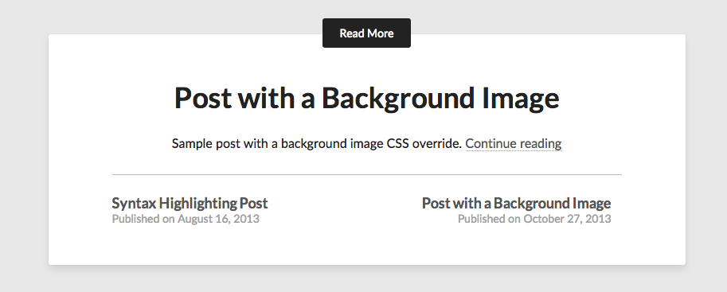

# Grav Related Pages Plugin

`Related Pages` is a [Grav](http://github.com/getgrav/grav) plugin that calculates related pages for the current page. It uses a highly configurable set of options to determine a **score** for each page you configure it to look at and compare.

It has 4 main calculation options that may be combined to produce very accurate results:

* Explicit page references in the header of a given page
* Taxonomy to Taxonomy matching.  i.e. comparing the number of matching tags in other pages
* Taxonomy to Content matching.  i.e counting the number of times a tag is in other page content
* Content to Content matching.  A comparison of the content between current and other pages (caution)

You can configure which combination of methods to use, customize the scoring, adjust how many related pages to show, cut-off scores and more!



# Installation

Installing the Related Pages plugin can be done in one of two ways. Our GPM (Grav Package Manager) installation method enables you to quickly and easily install the plugin with a simple terminal command, while the manual method enables you to do so via a zip file.

## GPM Installation (Preferred)

The simplest way to install this plugin is via the [Grav Package Manager (GPM)](http://learn.getgrav.org/advanced/grav-gpm) through your system's Terminal (also called the command line).  From the root of your Grav install type:

    bin/gpm install relatedpages

This will install the Related Pages plugin into your `/user/plugins` directory within Grav. Its files can be found under `/your/site/grav/user/plugins/relatedpages`.

## Manual Installation

To install this plugin, just download the zip version of this repository and unzip it under `/your/site/grav/user/plugins`. Then, rename the folder to `relatedpages`. You can find these files either on [GitHub](https://github.com/getgrav/grav-plugin-relatedpages) or via [GetGrav.org](http://getgrav.org/downloads/plugins#extras).

You should now have all the plugin files under

    /your/site/grav/user/plugins/relatedpages

# Usage

The default configuration provided in the `user/plugins/relatedpages.yaml` file contains sensible defaults:

```
enabled: true                   # set to false to disable this plugin completely
limit: 5                        # the number of related pages to display
show_score: true                # toggle to determine if scores should be displayed in output
score_threshold: 20             # minimum score needed to show up in the list
filter:                         # filter a configurable collection of pages to compare
    items:
        @page: /blog            # supports @self, @page, and @taxonomy collections
    order:
        by: date                # order type by default
        dir: desc               # order direction
page_in_filter: true            # true if the current page must be in the filtered collection
explicit_pages:
    process: true               # true|flase to enable this explicit page matching
    score: 100                  # score (0 - 100) to give explicit pages
taxonomy_match:                 # taxonomy type matching
    taxonomy: tag               # which taxonomy type to use
#   taxonomy: [category, tag]   # multiple taxonomies example
    taxonomy_taxonomy:
        process: true           # true|false to enable taxonomy to taxonomy matching
        score_scale:            # scores for number of matches
            1: 50
            2: 75
            3: 100
    taxonomy_content:
        process: true           # true|false to enable taxonomy to content matching
        score_scale:            # scores for number of matches
            1: 20
            2: 30
            3: 45
            4: 60
            5: 70
            6: 80
            7: 90
            8: 100
content_match:                  # Disable this if you have lots of posts, performance implications...
    process: true               # true|false to enable content to content matching
```

To make your own modifications to the configuration options, you should copy the `user/plugins/relatedpages/relatedpages.yaml` file into a file: `user/config/plugins/relatedpages.yaml`.  Then if you wish to modify a particular setting you should copy the whole node and modify it, for example:

```
explicit_pages:
    process: true               # true|flase to enable this explicit page matching
    score: 75                   # score (0 - 100) to give explicit pages
```

# Explicit Pages

To use the explicit page match functionality, simply add a `related_posts` array with **slugs** to the posts you wish to be related:

```
related_pages:
    - /blog/code-highlighting-post
    - /blog/sample-link-post
```

# Taxonomy to Taxonomy Matching

This should be used if you wish to match a taxonomy (for example `tag`) to other pages.  The more tags that match, the higher the score.  For example if your current page has `tags: [photography, city, new york, night]`, and another page had `tags: [photography, city, new york, day]`, there would be 3 matches, and according to the default scores, that would mean a match score of `100`.  You can of course configure the scoring to best suite your site.

# Taxonomy to Content Matching

This methodology takes the current pages taxonomy (for example `tag`), and counts the number of times these items are mentioned in the content of other pages.  The higher the number of matches to tags, the higher the score.

# Content Matching

Content Matching uses a string comparison function to calculate the overall similarity of the current page to the other pages in the collection.  A score of `100` means the content matches 100%, while a lower number means less similarity.  This is a very powerful mechanism, but because of the amount of work being done, and with a large amount of articles, this could cause a bit of a slowdown before the values are cached.


# Display a List of Related Pages

When all the enabled methodologies have been processed, a unique list in order of score (highest first) is created.  This array of page 'paths' is stored as a Twig variable `related_pages` that can be accessed in your Twig templates of your theme.

To display a list of related pages, you need to reference the provided `relatedpages.html.twig` or provide your own modified version in your theme, and reference that.  For example:

```

    <h4>Related Posts</h4>
    

```

This will ensure that the `relatedpages` plugin is installed and enabled, and also that there are some related pages before including the template to render them.

# Note about Performance

This plugin processes during the `onPageInitialized` event.  It first **checks cache** to see if this page has been processed before, and if not, it runs through the configured options to build the list of related pages.

All of this is pretty fast except for `content_match` which performs a full comparison using the content of the current page and comparing it with every other page in the configured collection.  If you have lots of pages, this could get quite slow.

This work is only performed the first time after a **clear-cache** event, after that it is cached for subsequent requests.  If you have the **debugger** enabled, you can see the state of **cache hits** and **cache missses** in the **messages** tab.
